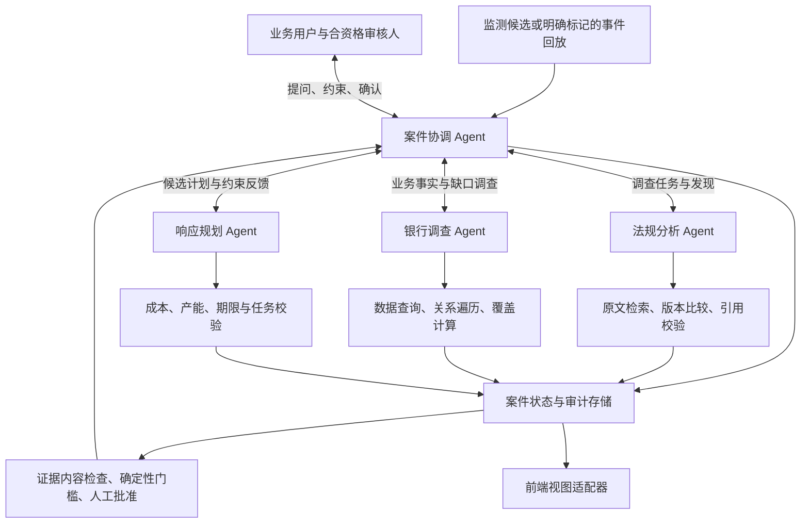

# 架构与代码 Review：从规则演示走向可交互的多 Agent 原型

日期：2026-09-11。评审依据依次为 [require.md](../require.md)、当前实际数据与代码、[原项目构想](../Regulatory_Change_to_Action_Design.md)、[B 构想](<../logic A-B-C/B-Logic.md>)、[C 构想](<../logic A-B-C/Part_C.md>)、[Integration Guide](../Integration-Guide.md)，同时完整阅读 A。本文是待讨论的架构建议，未将构想直接实施到业务代码或银行数据。

**主要结论：保留已有确定性计算和证据完整性检查，把业务调查、证据映射、问题选择与响应方案设计改成能使用工具、接收反馈、调整计划的 LLM 循环。建议“1 个协调 Agent + 3 个专家 Agent”，不按 A/B/C/D 四段算式划分 Agent。AHP 从主线降为可选方法配置。**

现在的主要问题不是 if/else 数量多，而是：很多业务结论已经预设；各步骤缺少实质性的输入输出依赖；没有持久化的案件、访谈和计划变更；需要语义判断的部分反而主要靠查表，而唯一实际使用 LLM 的地方是缺少原文上下文的权重草稿。

## 1. 本轮检查和可复现证据

已阅读 `agent/` 的实现和测试、`scripts/dataset_runtime.py`、评测脚本、当前 ESG 义务/控制/方案/角色/缺失事实及矩阵注册记录。当前 agent 使用的是工作区根目录 **`calibrated_v0_2/`**，不是上轮交付时的 `data/calibrated_v0_2/`。

实跑结果：

| 检查 | 结果 | 能说明什么 |
|---|---|---|
| `unittest discover -s agent` | 47 通过 | 现有实现符合这些测试的断言 |
| `unittest discover -s scripts` | 12 通过 | 原计算、输入隔离和元数据门槛测试通过 |
| `scripts/run_eval.py` | 14 项中 12 通过、2 跳过 | IPS 渠道范围、DORA 指定供应商判断仍未完整测试 |
| 额外反例探针 | 发现下表行为 | 说明现有绿灯未覆盖的重要边界 |

合计是 73 项检查、71 通过、2 跳过，不是 73 项全部通过，更不是模型准确率。评测中的多数断言没有运行真实的多步 LLM 调查。

复现命令：

```bash
.venv/bin/python -m unittest discover -s agent -p 'test_*.py'
.venv/bin/python -m unittest discover -s scripts -p 'test_*.py'
.venv/bin/python scripts/run_eval.py
.venv/bin/python research/review_probes_2026-09-11.py
```

[反例脚本](review_probes_2026-09-11.py) 只对内存副本做变更；没有调用付费 LLM，也没有修改真实审核记录。结果保存在 [review_probe_results_2026-09-11.json](review_probe_results_2026-09-11.json)。缓存路径检查将 LLM 函数替换为“调用即报错”，当前 demo 仍能完整跑完，确认本次缓存条件下 **LLM 调用为 0**。

## 2. 对照 require.md：哪些已经有，哪些只是标题

| 要求 | 当前实现 | 评审结论 |
|---|---|---|
| 监测权威来源并检测变化 | `run_demo.py:39` 从现成 register 取固定 ESG 事件 | 是登记事件回放；没有监测或版本差异检测 |
| 保留原文、版本、日期与引用 | 数据有来源 ID、意译、定位，全文版本配对未补齐 | 数据基础有价值，但 CLI 只展示 ID/状态，无法现场证明“具体什么变了” |
| 适用性访谈 | 规则输出 `4/5 products in scope` | 没有实际问银行业务事实；输入审核人和 AHP 比较不等于 applicability interview |
| 控制缺口分析 | 用既有 requirement→control ID 和覆盖标签查表 | 有初步设计缺口检查，尚无动态检索/语义映射和有效性核验 |
| 业务影响链 | 运营图数据存在，主流程没有遍历 | 流程、系统、数据、供应商、责任人的价值还未展示出来 |
| 负责人和截止日期的实施计划 | 生成一个 option 包装对象，列岗位候选 | 无明确 owner、target date、交付步骤和任务依赖，不是已指派行动 |
| 完成证据与日志 | 对空 evidence 数组运行元数据 gate，结果 False | 正确阻止无证据结案；尚无上传、内容检查、状态流转、恢复和成功闭环 |
| 合资格审核、区分原文/解释/建议 | 底层保留 silver，部分结果保留 review status | 聚合与 CLI 展示丢失部分限定；输入一个岗位名也没有批准任何具体法律结论 |

保留 deterministic maths 是正确的。`require.md` 并没有要求气候风险评分模型、AHP、固定四 Agent、判例相似度检索、全法规覆盖或自动闭案。应优先补齐它明确要求的调查、访谈、指派、证据与可追溯性。

## 3. 代码中的高优先级问题

### R1 / P1：人工拒绝会被当作批准，空 AHP 表也能通过

位置：[review_matrix_cli.py](../agent/review_matrix_cli.py) `run_review_session`，第 37—49 行；[exposure_esg.py](../agent/exposure_esg.py) `matrix_from_pairs` / `ahp_weights`，第 174—200 行。

- 输入 `n`、`skip` 或任意非 `adjust` 字符串，仍会走到 `status='confirmed'`。
- 缺失 pair 时矩阵默认值为 `np.eye` 的零；没有完整性检查。空 pairs 实测得到 materiality=1、其余=0，CR=-0.892857，代码只检查 CR≥0.10，因此接受了这张无效表。
- 当前不检查 pair 数量、重复 pair、对角项、非有限数、合法维度与比例范围；注册表复用也没有绑定条文版本、方法版本和作用范围。
- Prompt 只有 requirement ID 和维度名，没有要求正文、引用、银行场景，却要求模型给出“基于本条监管”的理由。这种理由无法由调用输入证明。

建议：只有明确确认才批准；其余输入为取消/待处理。先验证 n(n−1)/2 个唯一比较、正有限数、方向、互反关系和选定尺度，再算 CR。注册表绑定输入版本/hash、方法和审核对象。即便数学检查全部通过，CR 也只是内部一致性，不能证明权重适合银行或符合监管要求。

### R2 / P1：适用性规则把未知、时间和项目范围混在一起

位置：[applicability.py](../agent/applicability.py)，第 49、101、140、166、211 行附近。

实测：

| 输入改变 | 当前结果 | 问题 |
|---|---|---|
| `markets=[]` | `not_applicable` | 把缺资料当成不适用 |
| `markets=['US']`，要求 jurisdictions 含 EU | `direct`，理由称 US 位于 EU/IE 范围 | `'EU' in covered` 让所有非空市场直接通过 |
| `entity_classification=null` | `not_applicable` | 空值被当成明确不匹配 |
| 非信贷机构 + 要求日期在未来 | `indirect` | 时间分支提前返回，机构条件未检查 |
| 新增未识别信贷产品类型 | 该产品未进入结果 | 候选预过滤绕过了 unknown 分支 |

US 的反例证明的是**匹配函数及其理由错误**，并不表示欧盟银行所有海外业务最终都应判不适用。机构级义务与产品地域条件还需按具体条文建模。

更深的问题来自设计：`indirect` 同时表示“尚未适用”“银行层面有关”“不在当前 demo 优先范围”。这些不是同一种状态。建议拆分：

```json
{
  "legal_scope": "in_scope | out_of_scope | unresolved",
  "temporal_status": "upcoming | applicable_now | repealed | unresolved",
  "demo_scope": "selected | deferred",
  "review_status": "provisional | approved",
  "missing_facts": [],
  "citations": []
}
```

当前 SNCI 的数据建模也要一起改：上轮校准把 `snci_status=false` 放进了 ESG applicability conditions，而要求记录只保留非 SNCI 日期、change register 却有两类日期。分类资格与日期选择应分离，不能把 SNCI=true 当作“不属于机构类型”。这是数据合同和代码双方的问题，不能仅靠再加 if 修补。

还需补充：失效/撤销状态分支实际未实现；银行/产品信息冲突没有完整检查；聚合输出未保留完整审核限定；`products.json#/PRD-...` 不是数组可解析的 JSON Pointer。记录 ID 与 JSON Pointer 应使用不同字段。

### R3 / P1：缺口判断没有真正验证“要求—控制—证据”

位置：[gap_assessment.py](../agent/gap_assessment.py)，第 18—48 行。

当前 `control_ids=[]` 立即返回 missing。没有链接只说明“当前映射表没有链接”，不等于相关政策/控制实际不存在；必须区分搜索覆盖不足、映射缺失与已确认能力缺失。

当前 `evidenced` 分支只需某个控制是 operating 且 evidence ID 列表非空。实测一个 **coverage 为空、evidence ID 不存在** 的控制仍返回 evidenced。函数没有收到证据登记表，所以无法验证证据内容、期限、作用范围或测试结论。

覆盖检查又将控制所有 `coverage[]` 无差别应用给关联要求。因此：

- 对“授信准入标准”，返回“existing_portfolio 没覆盖”不一定是对本条要求的正确缺口解释。
- 对“至少十年长期视角”，当前仍返回同一个 existing_portfolio 缺口，完全没有检查期限维度。
- 有多个控制时，应评价它们在本条要求上的联合覆盖，而不是任意一条未知就泛化 partial，或任意一条 operating 就视为全部有证据。

特别需要重新审核 9 月 11 日补入的两个链接。`split_from_requirement_id` 或相同 `created_at` 只证明记录血缘，不证明父条款控制适用于每个拆分后的子条款。把 onboarding screen 关联到十年风险视角，需要独立的语义证据。不能把“双方 ID 对称”当作映射正确的验证。

建议输出三层：`mapping_support`、`design_coverage`、`operating_evidence`。LLM 可以查找文本并提出候选映射与缺口解释；确定性检查验证 ID、出处与证据条件；缺乏充分搜索范围或明确否定证据时使用 insufficient_evidence。

### R4 / P1：上游分析不会改变响应方案，且方案作用范围被放大

位置：[run_demo.py](../agent/run_demo.py)，第 57—90 行；[response_design.py](../agent/response_design.py)，第 22—60 行。

暴露度结果只用于打印。缺口结果也只用于打印。`compare_response_options(files)` 完全没有接收它们。将要求和控制集合清空后，方案比较结果实测仍一字不变。这不是成本公式本身的错，而是方案输入与调查结果没有接起来。

现成的三种 option 只声明解决 `DATA-GAPS` 和 `CREDIT-MONITORING` 两条要求；`run_demo.py` 却把全部 8 条 ESG 要求传给 `package_chosen_option`，于是生成“一个方案解决 8 条要求”的对象。风险偏好、十年视角、授信政策等覆盖并没有被证明。

建议：方案必须由具体 gap 和 scope 生成，每项 task 记录 addresses_gap_ids、requirement_ids、验收条件、成本输入及依赖。对不覆盖的要求明确标记 deferred/unaddressed。保留现有三种方案作为 seed templates，而不是无论调查结果如何都输出的固定答案。

### R5 / P1：代理风险却显示 confidence=100、data debt=0

位置：[exposure_esg.py](../agent/exposure_esg.py)，第 53—63、111—120、206—264 行。

`PORT-SME-006` 两个风险维度都来自行业代理，实测 confidence=100、data debt=0。公式计算的是几个输入字段的完整程度，不是风险判断正确的概率；它没有考虑代理依据质量、模型不确定性、缺少位置颗粒度等。

仅以行业生成 physical risk 高低是非常粗的合成假设，不能因为有 country 就认为物理风险信息充分。未来 assessment date 也直接得 freshness=100，应先报日期异常。

建议主界面展示“事实覆盖率 / 代理依赖 / 未决事实 / 判断依据等级”，不要把这些包装成概率。可以保留方法内部的数据质量分，但应改名、公开定义。不要简单用 confidence 乘 exposure 把资料差的组合风险压低。

### R6 / P1：分数对文件分组方式敏感

当前数据是 cohort，而不是单户贷款。将 `PORT-SME-002` 平分为两个事实相同的组，保持总余额、客户数、行业和风险信息不变，原 84.4/high 变成两个 65.5/medium。

如果这个分数用于决定哪些业务必须整改，文件如何切行就能改变决策，缺乏稳定性。当前各 SME 行业大多对应单个 cohort，materiality 与 sector_concentration 又较大程度重复使用同一余额信息。

建议以稳定的业务单位计算（例如业务线/行业/既定组合），先报告真实金额、份额和数据缺口。若按 cohort 排序，说明它仅衡量该记录的工作优先程度，并在合并任务时恢复组合级事实，测试拆分/合并不应改变的结论。不要为了让九行“分得开”就反向选择阈值。

### R7 / P1：没有真正的 owned、deadline-aware action

当前生成对象没有 `owner_role_id` 或 `target_date`，没有责任接受状态和具体交付步骤。按成本中心列出全部岗位，连 CISO/TPRM 都可能成为 ESG Risk 候选，使用的信息不足以形成有用分配。

显示的 451,436 欧元是三年 programme TCO，建设成本是 154,436 欧元。代码标明了 cost_basis，这点是好的；但把它放进单个“行动预估成本”仍容易误导。需要区分 programme / workstream / task，避免未来每个任务重复摊一个完整 TCO。

“原法定日期已过”与“从今天开始的补救计划能否按新内部目标交付”是两个问题。当前每个方案只显示 False，不能辅助选择。不要修改法定日期让 demo 看起来可行；应显示 overdue、临时控制、内部目标、预计完成日和待批准状态。

最低 TCO 可以作为条件性比较结果，但回车默认把它选成响应方案的交互弱化了 pending review/capacity 的限制。更好的主操作是“查看候选建议及未决约束”，明确选方案后再做责任与资源确认。

### R8 / P1：访谈、保存、恢复和证据闭环都没有接入主路径

`missing_facts.py` 有 fixture 读取函数，但 demo 不调用它，不提缺失事实问题，也不使用答复更新状态。AHP 确认不是业务访谈。`check_closure(action, [])` 永远面对空证据，无法展示完成一项行动的闭环。

当前唯一区分运行的持久状态是 AHP registry；event、finding、human answer、plan、action、evidence 和审计事件都没有统一保存。`ACT-OPT-ESG-AUTOMATED` 也会在不同案件/运行中重复。

建议将案件持久化和一次“问—答—重算—更新计划”列为下一轮主线。审批和结案记录必须绑定具体 case、计划/证据版本，而不是单一审核人姓名。元数据 gate 保留，但只作为内容审核和人工批准之外的一层检查。

## 4. 构想文档中应修改的部分

| 文档观点 | 建议 | 原因 |
|---|---|---|
| B：固定权重不成立，必须 AHP | 改为可选方法；主线可用经过说明、版本化的简单规则/量化事实 | AHP 仍是主观判断；低 CR 不产生外部有效性。每条义务重新签两张表会压过本项目核心体验 |
| B：每条记录是 borrower，可关联第二笔贷款推断 | 按 cohort 合同重写，不为展示推断强加虚构贷款 | 当前没有 borrower_id；“没有第二笔”与“数据根本不是借款人粒度”不同 |
| B：有国家=地理信息满分 | 只说明字段存在；具体判断需定义所需颗粒度 | 物理风险通常需要更具体的资产/地点与风险依据，country 不能证明充分性 |
| C：三条 human-reviewed 要求、六能力目录 | 改为实际 8 条 silver 要求；能力目录可作为检索分类，不预填答案 | 当前没有这些已审核三条要求或完整 CAP 文件 |
| C：95% NACE、90% ESG、100% high-materiality 是闭案标准 | 可以保留为明确批准的 demo 内部验收标准 | 本次材料没有证明它们是 EBA 法定阈值；不能由模型或展示文案改成监管要求 |
| C：insufficient_evidence 的缺口严重度固定为 70 | 分开“调查优先级”和“已证实整改优先级” | 资料不足值得查，但不能因此假定已经存在固定严重度的缺口 |
| Guide：所有不确定都暂停整条链 | 仅暂停依赖该事实的结论/提交动作；允许其他调查和条件性估算继续 | 这是最值得增加的灵活性，避免所有请求汇成一个人肉瓶颈 |
| Guide：LLM 永远不能判断缺口，Prompt 5 又让它判断 | 明确“候选语义判断—验证—人工批准”三层 | 禁止 LLM 所有判断会把 agent 限制成文本改写器；允许它直接批准又过度放权 |
| Guide：所有候选行动纯查表 | 模板提供标准步骤/证据模式；LLM 按 scope、gap、约束组合和调整 | 目录是先验，不是已知答案；否则未见缺口没有合理处理路径 |
| Guide：Agent D 只计算成本 | 成本模块保留为工具，无需独立 LLM Agent | 没有自主调查/工具选择的算式模块，不值得一个角色上下文和调用成本 |
| Guide：前端形状不能改、后端迁就 | 前端维持五张摘要卡可以；加一层 view adapter | UI 卡片顺序不应决定实际执行图；后端需支持部分完成、阻塞、撤销、版本和返工 |
| Guide：判例放在 evaluation_ground_truth | 运行记忆另存，只纳入可追溯的已审案例 | 评测标签和运行知识混在一起会泄漏；人点“准确”也不能自动成为未来法律证据 |
| Guide：每个监测候选都由人先判断重要性 | agent 先分类、解释相关性并提请适当审核 | 人工审核应集中在关键结论，不应把 require.md 的业务筛选全部交回给人 |

Integration Guide 还存在具体数据漂移：写 `internal_day`，实际是 `delivery_day`；示例使用 CC-210/CC-500、650/780 日价，而当前 Head of Credit Risk→CC-200/544、CIO→CC-300/850。它不应再标为“字段和数值已核实，可直接开发”。当前工作区也没有所声称的 `frontend_app/` 源码，因此本轮没有验证前端实际兼容性。

Guide 的恢复队列流程应保留 resolved 待办与历史，避免删除后丢失依据；事实更新、审计写入和恢复触发应可重放、幂等。多个要求缺事实时，不能只保留最后一个 `stage.human`；问题要成为独立对象。

## 5. 推荐的多 Agent 架构

公开工程经验也区分“预定义路径的 workflow”和“模型依据反馈选择工具与步骤的 agent”，并强调先使用简单可组合结构。这支持把灵活性放到调查与规划，而不是废除所有代码约束。[Anthropic 工程说明](https://www.anthropic.com/engineering/building-effective-agents)

以下是针对本项目的数据和范围提出的设计，不是照搬外部产品架构。



| 角色 | LLM 可以自主决定 | 工具 | 主要产出与边界 |
|---|---|---|---|
| 案件协调 Agent | 这次还缺什么、找哪个专家、是否再调查、向用户问哪一个高价值问题、何时重规划 | `get_case`、`delegate`、`request_fact`、`propose_plan_revision` | 工作计划、汇总与对话；不能直接把 pending 变成 approved |
| 法规分析 Agent | 查哪版原文/交叉引用、拆哪条义务、哪些条件/例外需要复核 | `search_sources`、`get_clause`、`compare_versions`、`validate_citations` | 有出处的变化、适用性候选及不确定项；没有快照则说明无法证明差异 |
| 银行调查 Agent | 从产品、组合、控制文档、系统依赖中选调查路径；发现冲突后追查 | `query_records`、`search_governance`、`trace_dependencies`、`compute_coverage` | 事实、候选映射、设计/运营证据缺口、问题；不能把 proxy 或没搜到伪装成事实 |
| 响应规划 Agent | 按 gap/scope 组合任务，提出 manual/automated/hybrid 或分阶段方案，结合约束修改方案 | `find_roles`、`calculate_cost`、`check_schedule`、`validate_plan` | 2—3 个有依据的候选计划、推荐理由与未决条件；不能自造已批准预算、承诺资源或批准自己 |

这些角色可以使用同一个模型、同一个 Python 进程。区别来自任务、上下文、工具权限与产出合同，不需要四套服务，也不需要把五个业务职能各做成一个 Agent。

不让所有 Agent 互相自由聊天。协调者负责派发和合并；专家读取同一版本的事实，返回结构化发现；应用服务负责持久化变更。法规取证和银行基础事实调查可以在依赖允许时并行；规划应等待最小有效输入，不能假装所有阶段都可独立并行。多 Agent 的成本和协调复杂度需要按案例衡量，不能直接套用外部研究系统的性能提升数字。[Anthropic 多 Agent 系统经验](https://www.anthropic.com/engineering/multi-agent-research-system)

### 自主性应放在哪里

允许 LLM：选择检索查询、提出候选适用性解释、判断文本在什么范围支持控制映射、组合行动、提出 owner 候选、解释权衡、起草带来源/区间的工作量假设、在新约束出现时重规划。

保留代码：金额/分母/日期计算、有效 ID 与引用解析、计划 scope 一致性、证据 hash、权限、审批条件、状态转换、禁止重复执行和有限循环。

保留人工：关键法律解释的合资格确认、事实争议处理、预算/资源与责任接受、实质证据批准。草稿调查和成本预览可在法律审核 pending 时继续，但必须始终显示 provisional，不据此宣称合规获批。

LLM 起草一个“需要 10—15 人日”的估算可以有价值，前提是字段明确 `estimated`、说明依据与待确认人。代码只计算这些假设的结果，不把它们升级为测量值。比禁止模型提出任何数值更实用，也比模型直接写最终 TCO 更可审计。

### 一次受约束的循环

```text
读取当前 case、已确认事实和未决问题
→ 协调者选择一个允许的下一步
→ 专家调用查询/计算工具，取得新的观察
→ 校验发现与引用，写入带版本的 case
→ 新证据不足：改查询或提出具体问题
→ 新约束改变计划：只重做受影响的调查/计算
→ 达到审查条件：展示具体方案并请求批准
```

原型可设置每个专家最多 3 轮取证、案件最多 2 次自动重规划等初始预算，再按实测调整；达到预算或连续无新信息时，返回有解释的未决问题。需要“下一步动作及其简短依据”的日志，不需要展示模型内部推理全文。

## 6. 最小状态与数据增量

先用 Python + SQLite/文件服务即可，不必为这次 demo 引入图数据库、向量数据库或分布式调度。约十几份治理记录可以先用关键词/字段检索；只有检索评测证明需要时再加入 embedding。

建议增加/明确：

| 对象 | 最少需要的信息 |
|---|---|
| `Case` | case_id、source/requirement version、data snapshot、当前目标、用户约束、状态、运行预算 |
| `Finding` | claim、fact/inference/assumption、record/clause 引用、支持范围、冲突、review status |
| `Question` | 对应 fact_id/字段、为何影响决策、回答格式/单位/分母、负责人、状态、答复与来源 |
| `GapAssessment` | requirement_id、所需维度、候选控制、检索范围、design coverage、operating evidence、未决项 |
| `PlanVersion` | addresses_gap_ids、未覆盖项、方案参数、工具计算结果、约束、推荐理由、批准对象版本 |
| `Action` | 独立 case 内 ID、owner/A/R、步骤、内部目标、法规日期、依赖、接受/执行状态、验收条件 |
| `Evidence` | action_id、类型、实际文件、hash、日期、scope、内容检查结果、人工审核记录 |
| `AuditEvent` | 谁在何时，基于哪些输入版本，调用什么工具/提交什么决定，导致什么状态变化 |

事实答复应成为带 provenance 的 patch，不直接改写原始 baseline。新答复只使依赖该事实的发现/计划失效并重算。必须区分“当前日期”“冻结的场景 as_of”“业务数据快照日”；不能重跑三天后仍不加说明地把 9 月 8 日称作今天。

不必再加完整 CAP 层和大行动目录才能开始。先用现有原子要求和治理文档，以 requirements 的判断维度形成候选映射。需要更多语义材料时补一两份明确标为 synthetic 的短政策/程序，而不是批量补齐所有控制去消灭 demo 缺口。

上轮留下的 source pair 仍没有可复现全文。若要展示“检测到了某一变化”，必须补齐该变化的两份真实版本并验证；否则清楚展示“来源更新事件回放/新指南采用场景”，不要伪造旧文或把咨询稿当旧生效法规。

对证据至少准备两个明确标记的模拟样本：一个缺范围/缺测试、应被拒绝；一个针对**一个窄任务**有完整覆盖计算和测试结果、可进入人工审核。上传一份政策不能证明全部 8 条 ESG 要求已解决。

## 7. 更适合展示的主线

先按约七分钟设计，最终随展示约束调整：

| 时间 | 用户看到的内容 | 真正展示的能力 |
|---|---|---|
| 0:00—0:45 | 选定来源/版本，展示具体要求及原文定位；说明是否回放 | 可靠的入口与可追溯性 |
| 0:45—2:00 | 协调者让法规/银行专家调查，发现 onboarding 与 existing book 的范围不同 | 使用工具进行语义调查，而非读一个预填 gap 标签 |
| 2:00—3:00 | 主动问一个确实会影响判断的业务事实，记录答复后刷新相应结果 | 访谈与恢复；保持不知道的部分为未知 |
| 3:00—4:30 | 展示方案，用户追加“建设预算最多 €90k”约束，agent 修改候选建议 | 真实重规划；现成 automated 建设 €154,436 超预算，不能仅因长期便宜继续推荐 |
| 4:30—5:30 | 展示一个具体任务，提议有职责依据的 owner、内部目标及验收条件，用户确认 | 实际指派，保留原法规日期已过的事实 |
| 5:30—7:00 | 错误证据被指出具体缺项；合适的模拟证据进入测试/人工审核；展示日志 | 内容核验和可解释的状态变化 |

€90k 是建议用来演示的新增用户约束，不是本行已批准预算。hybrid 建设 €79,002、manual €26,818 可进入候选比较，但交付产能、合规适足性仍需检查；不能直接写死“用户说90k就选hybrid”。如果提出临时人工控制+后续自动化，需要重新定义工作阶段与成本，不能把两个整套 TCO 相加。

现有能源数据覆盖率 fixture 的 65% 可以作为明确的模拟业务答复，但需说明它按哪个总体和分母计量，只改变有依赖关系的判断。它不会天然改变“全体存量客户每年审核一次”的当前 TCO；如果要影响整改工作量，应显式新增并审核“未覆盖客户需要补采集”的计算关系，不能只是为了演示让每个数字都变化。

AHP 可在“方法与假设”抽屉里查看、修改并重算。主屏幕优先展示 €2.3bn 组合、NACE 客户/敞口口径、控制覆盖范围、真实未决问题、任务和证据，不用九行小数分数占据整场演示。

## 8. 实施顺序与验收标准

### 第一步：先修影响可信度的错误

修确认语义、AHP 输入验证、适用性 unknown/地域/时间、证据 ID 实查、requirement-specific 覆盖、2 条方案被放大成 8 条的问题。重审两个按拆分血缘补入的控制映射。现有“不存在链接就 missing”的测试也应修改，不能让错误行为成为验收标准。

### 第二步：先做一条可以继续对话的调查链

增加 case 存储、工具接口、协调者与银行调查 Agent；支持自然语言问题、结构化回答、来源记录、状态恢复。把法规专家和规划专家接到同一合同，形成四角色设计。避免先铺满所有监管和前端页面后才接真实行为。

### 第三步：方案生成、约束重规划和具体任务

将 `calculate_options` 提取为接收 scope/workload/option 参数的计算工具；旧 3-option 输出作为回归基线。规划 Agent 提案，经工具检查后展示；增加 owner 语义匹配、期限、依赖和验收。人日按职能/团队计算，不能把一个负责人季度额度当整个 IT 交付团队产能。

### 第四步：可审查的证据和展示集成

证据上传与内容提取、匹配任务范围、运行对应测试、人工审核、持久化审计；前端通过 adapter 映射到摘要/队列/行动卡。保留失败、等待、已替换计划和历史答复，不只显示 done/active/pending。

架构的关键验收不是“用了四个 Agent”，而是以下反事实：

- 同一缺口换一个名称/缺少预填 control_id，系统仍能找到或合理质疑相关证据。
- 有充分新证据时减少/撤销对应任务；没有证据时不编造 missing 的确定性结论。
- 用户更改预算/交付约束，候选计划和对应计算发生有解释的变化。
- 回答问题后只更新相关判断，重启能恢复，不重复创建行动。
- 拒绝审核不会被接受；仅上传文件或伪 evidence ID 不能闭案。
- 新产品、未知地区、未来日期、监管版本变化触发正确的范围检查。
- 拆分同一 cohort 不改变不应受存储粒度影响的组合结论。
- 不从 evaluation_ground_truth、旧叙述答案或未经审定的“判例”读取预期答案。

评测应记录结果正确性、引用支持、未决事实处理、任务覆盖、工具调用与延迟；不要强迫 LLM 必须按唯一固定工具序列执行。首先补这些小规模行为用例，比继续增加“输出至少有一个 high”的断言更有价值。

## 9. 次要工程问题与保持项

需要整理：生成脚本仍输出 `data/calibrated_v0_2`，runtime 却读根目录版本；当前手工链接修复没有回到生成逻辑，重建会产生另一份不同数据。数据读取根目录、版本和迁移策略必须统一，评审期间不要直接重建覆盖现有内容。

现有 `mapping` 输入视图还把整个 `statements` 字段删除，可能连政策正文一起丢失。后续盲映射任务应保留 statement 的文本，仅移走已填的要求链接和覆盖答案。这也是上轮输入隔离实现需要改进的地方：防止答案泄漏不能以删除必要证据为代价。

`test_review_matrix_cli.py` 对全局 FAKE_DRAFT 使用浅复制，修改 nested pairs 会污染后续测试；本轮输出中第二个测试已读到先前修改的 ratio=9。应使用独立深复制 fixture。LLM 层后续需增加结构化工具接口、输出验证、有限重试/超时、模型/provider 配置与调用日志；不能只对 JSON parse failure 抛异常而丢失案件状态。

值得保留：成本使用确定性计算；risk/revenue/capacity 未知保持 null；原始与同业数据隔离；输入 allowlist；FRTB 不轻率启动大整改；proxy 有显式标签；证据 hash 与人工审核元数据检查；当前测试体系和一次运行基线。

建议讨论时先决定两个产品取舍：**是否将 AHP 移出主线；是否把下一轮目标锁定为“一个 ESG 案件的调查—追问—重规划—指派—证据审核闭环”，其他监管保持辅助验证。** 这两个决定比先选 multi-agent 框架更影响 demo 的完成度。
