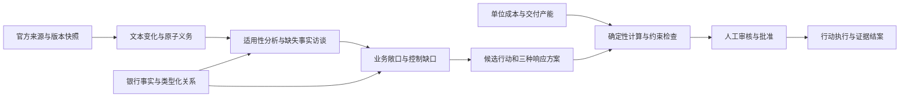

# Regulatory Change-to-Action：同类产品、公开数据与可复用方案

研究截止：2026-09-08。研究对象是“监管变化 → 机构适用性 → 业务敞口 → 控制缺口 → 成本化行动 → 证据结案”，不是一般法律问答。以本地 [require.md](../require.md)、[项目构想](../Regulatory_Change_to_Action_Design.md)、[银行场景](../data/Bank_Context_Fictional_Digital_Bank.md) 和 [dataset skill](../data/regulatory-governance-dataset/SKILL.md) 为设计依据；市场材料只用于比较和组件选择。

本次查阅的公开材料中，没有确认到一个同时覆盖上述全链路、带 EU 银行内部事实及可信行动/成本/结案标签的公开数据集。商业产品主要组合监管内容库与客户内部资料；公开 benchmark 主要覆盖检索、问答、条文分类或交叉引用。这个结论限于下表已核查的项目，不代表全市场不存在其他数据。

## 1. 商业产品：借鉴对象模型和工作流

这里的“数据”分别指产品运行时处理的内容、模型训练数据和公开评测集。厂商说拥有监管内容库，不等于公开了训练集；宣传支持某功能，也不等于本次验证了其准确率。下表架构是官方公开的功能流程，不推测其私有模型、数据库或编排框架。

| 产品 | 公开可确认的数据与流程 | 公开数据集情况 | 对本项目的价值 |
|---|---|---|---|
| AscentAI | 将监管义务作为可追踪、可版本化对象；连接监管变化、义务清单与客户合规体系；支持变化比较与 GRC 集成 | 未在所查页面披露可下载的完整训练集或银行行动评测集 | 最接近本项目的义务对象设计：稳定 ID、版本、出处、变化影响、存量义务关联，不把一整份法规当作一个任务。见 [change management](https://www.ascentregtech.com/our-difference/change-management/) 与 [RLM platform](https://www.ascentregtech.com/rlm-platform/) |
| CUBE RegPlatform | 监管信息采集、分类和丰富化，结合机构画像筛选相关内容，再进入洞察与工作流；公开描述监管分类体系及 AI 能力 | 监管语料和客户画像属于产品内容；未找到公开完整训练/评测数据 | 借鉴“内容处理—机构画像—适用性筛选—工作流”的分层；把相关性、适用性、优先级分别存储。见 [官方 horizon scanning](https://www.cube.global/products/regplatform/horizon-scanning) |
| Corlytics | 结构化监管内容与义务；按活动和司法辖区分析适用性，关联政策、控制、产品；强调专家验证 | 所查资料未公开完整机构级义务—控制—行动标注集 | 借鉴逐条义务与内部控制的可审核映射，以及专家确认环节。见 [obligations management](https://www.corlytics.com/solutions/regulatory-obligations-management/) |
| IBM OpenPages RCM | 集中管理监管要求、内部义务和合规对象，并接入外部监管内容提供商；与企业 GRC 数据结合 | 产品支持外部商业内容源，不等于这些内容随产品公开；未找到完整开放行动数据集 | 借鉴内容源适配器与统一内部对象模型，避免一个来源的字段结构绑定全系统。见 [官方产品页](https://www.ibm.com/products/openpages/regulatory-compliance) |

不能据这些页面断言它们使用了 ObliQA、某个特定开源模型，或采用了本项目同样的三年成本引擎。尤其“能生成行动建议”和“有可解释、可复算、含产能约束的方案比较”是不同能力，公开材料不足以确认后者的具体实现。

## 2. 开源项目与标准：哪些部分值得用

| 项目 | 数据、结构与能力 | 可用方式 | 许可证/适配限制 |
|---|---|---|---|
| CISO Assistant | API 导向的 GRC 平台；公开仓库展示 Django 后端、SvelteKit 前端、框架库、风险、控制、证据和第三方管理 | 可评估为未来 GRC 接口或后台；优先借鉴控制/证据/责任人对象及框架库组织方式 | [仓库](https://github.com/intuitem/ciso-assistant-community)；[许可证](https://github.com/intuitem/ciso-assistant-community/blob/main/LICENSE.md) 区分社区 AGPLv3 与 enterprise 商业目录。不能把全部宣传功能都视为社区免费能力；接入前逐目录核查 |
| RegNLP MultiPassage-RegulatoryRAG | BM25、稠密检索、融合/重排及交叉引用信息；评估多段监管证据检索 | 最值得独立试验的检索基线；先比较 BM25、dense、RRF，再决定是否需要图特征 | [仓库](https://github.com/RegNLP/MultiPassage-RegulatoryRAG) README 声明 MIT，本次未独立核验完整许可证文件；依赖及数据授权需另查。它不是银行行动管理平台 |
| RegNLP RePASs / ObligationClassifier | 义务分类；用蕴含、矛盾与义务覆盖衡量监管回答；仓库提供义务分类数据文件 | 可作为证据回答的辅助评分与义务抽取基线 | [RePASs](https://github.com/RegNLP/RePASs)、[分类器](https://github.com/RegNLP/ObligationClassifier)、[论文](https://arxiv.org/abs/2409.05677)。指标依赖模型判断，不能替代法律审核；不能衡量成本、责任人或实际结案。许可证未逐项确认，不直接复制代码/权重 |
| NIST OSCAL | 以 JSON/XML/YAML 表达控制目录、实施和评估相关信息的标准模型 | 借鉴 control、implementation、assessment 的分离，未来提供映射/导出层 | [官方说明](https://pages.nist.gov/OSCAL/)、[仓库](https://github.com/usnistgov/OSCAL)。它是数据标准，不是监管变化或银行敞口数据集；本版没有宣称 OSCAL 合规 |
| compliance-trestle | 基于 OSCAL 的 Python 模型、CLI、文档组织与验证工具 | 若后续采用 OSCAL，可复用其校验/编写流程；目前先保留项目已有 ID 和轻量 JSON | [仓库](https://github.com/oscal-compass/compliance-trestle)，公开标示 Apache-2.0。采用前还需固定版本并验证转换语义 |

本次没有安装上述平台，也没有复制其实现；已在当前工作区完成的运行与校验脚本使用 Python 标准库。对于当前窄范围 demo，直接迁移整个 GRC 平台会增加对象映射、许可证和部署工作，收益尚不足以证明。

## 3. 公开数据：能补哪一层，不能补哪一层

| 数据/来源 | 内容和规模 | 本项目用途 | 限制与授权 |
|---|---|---|---|
| ObliQA | ADGM 监管文档上的自动生成 QA；说明称 40 份文档、约 64 万词、27,869 个问题 | 外部监管检索/回答基线，学习问题—证据配对方式 | 不是 EU 银行法规或真实企业行动。公开说明的 train 22,295 + dev 2,888 + test 2,786 = 27,969，与总数不一致；本次未下载全量数据逐条计数。[GitHub](https://github.com/RegNLP/ObliQADataset)、[HF 数据卡](https://huggingface.co/datasets/RegNLP/ObliQA/blob/main/README.md)；卡片标 Apache-2.0，但仍要核查底层监管文本使用条件 |
| ObliQA-XRef | 需要多段交叉引用证据的 ADGM 与 UK 金融监管问题；数据卡列合并集 17,394 条 | 测试跨条文引用、两段证据是否完整召回 | 仓库显示的总行数可能重复计入 combined/final/splits，不能直接全目录拼接。许可标为 other，须看 ADGM/PRA 来源条件；不能默认可任意商业再分发。见 [数据卡](https://huggingface.co/datasets/RegNLP/ObliQA-XRef) |
| MultiEURLEX | 约 65,000 份 EU 法律文本，23 种语言，EuroVoc 多标签；按时间分训练/验证/测试 | 主题分类、多语言召回和时间切分的设计参考 | 历史语料，不是最新法规状态库，也没有银行控制/行动标签；数据卡为 CC-BY-SA-4.0。见 [数据卡](https://huggingface.co/datasets/coastalcph/multi_eurlex) |
| LegalBench-RAG | 法律检索 benchmark，强调精确到字符区间的证据；组合 ContractNLI、CUAD、MAUD、PrivacyQA 等任务 | 借鉴 citation span 精度、召回和过度引用惩罚，不把“答案看起来正确”当作检索成功 | 主要合同/法律材料，不提供本项目内部银行图谱；README 要求遵守各底层数据授权。见 [官方 README](https://github.com/ZeroEntropy-AI/legalbenchrag/blob/master/README.md) |
| EBA / EUR-Lex / CBI | 官方法规、指南和说明材料；是权威内容来源，不是现成监督学习标签 | 构成本项目所选 EU/Irish 场景的主监管语料，逐来源记录版本与适用日期 | 需保存可用全文、定位与版本状态；公开网页存在不代表本次已取得完整快照。具体可读范围见 [来源审计](source_audit.md) |
| 本地 bunq 报告 | 真实银行公开报告的用户提供副本，包括年报、Pillar 3、ESG 等 | 借鉴三道防线、治理职责、业务与技术依赖、报告结构 | 不是 Northstar 的经营事实、预算、供应商或控制有效性证据；报告公开不自动等于可随数据集任意再分发。已独立登记文件哈希 |

建议保留三个独立评测域：外部检索 benchmark、本项目合成银行评测、以后人工复核的正式留出集。不要把同一义务的改写问题随机分到训练和测试，也不要把最终版法规用于声称只知道咨询稿时的历史预测。未来按法规版本/义务家族分组，再按时间切分，才更接近真实变化检测。

## 4. 按当前设计应采用的架构

落地时保留四个边界：

1. **检索给出来源，结构化数据给出事实。** 向量索引适合找条文与文件片段；金额、日期、布尔状态、责任人和图关系使用确定性查询。先采用 JSON/表结构和关系边即可，不必因“agent”直接引入图数据库。
2. **三类判断分别输出。** `applicability` 是法律适用性；`exposure` 是业务规模与相关程度；`capability_gap` 是现有能力与要求的差距。`confidence` 另列。FRTB 业务相关性有限，仍可能需要补事实确认适用性；资料不足不能自动变成不适用。
3. **LLM 起草，计算器计算，人审核。** 方案的人天、自动化率和交付期是显式假设；成本使用可复算公式。未知风险损失、收入影响、交付团队产能保留空值，最低 TCO 不自动转为推荐。
4. **证据计划与证据事实分开。** “required” 表示待收集，文件名和模板不能证明执行；结案至少检查文件、哈希、归属与人工审核元数据，再由审核人判断证据实质。

第一条完整演示建议选 **SME 存量授信的 ESG 监测**，以 `REQ-ESG-CREDIT-MONITORING-001` 为中心；数据缺口条款作为依赖。保留 Lending、Risk、Data/IT、Finance、Compliance 五方影响。ESG 其他原子条款作为支持目录，IPS/DORA/FRTB 为辅助用例。不要把当前 18 条要求包装成四套法规的完整覆盖。

## 5. 本次已经采用与后续可接入

已经采用：原子义务和精确定位、来源/合成事实/评测隔离、跨组稳定 ID、缺失事实登记、确定性成本与证据门槛、独立开发用例。交付见 [校准报告](calibration_report.md) 和 [校准数据入口](../data/calibrated_v0_2/README.md)。

可以下一步独立试验：以项目少量真实条文为索引，比较 RegNLP 式 BM25/dense/RRF 的证据召回；用精确段落/字符跨度评分；通过 API 适配 CISO Assistant 的证据或控制对象。是否接入以小样本结果和对象匹配成本决定。

当前不应做：用 ObliQA 替代 EU 正文；用 bunq 数据补成 Northstar 真值；将模型生成标签命名为 gold；拿 12 条开发用例报告泛化准确率；把咨询稿—最终稿包装成两份已生效法规的变化；用公开产品介绍臆造它们的技术栈或训练集。

以上是数据重新校准和组件选型研究，本次没有执行模型参数微调。当前数据规模与审核成熟度更适合原型验证、RAG 和规则边界测试。
